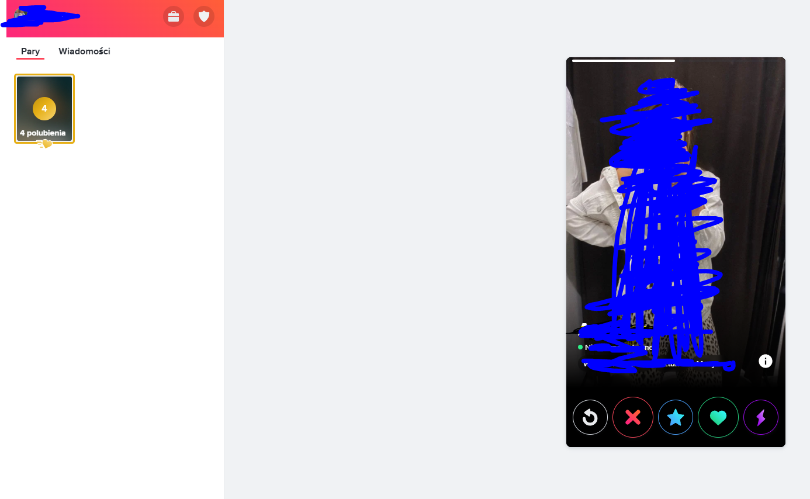

# About
Simple bot using selenium driver

# Requirements
install selenium chrome driver
install python requirements
```
pip install -r requirements.txt
```
create credentials.py like
email = '@gmail.pl'  
password = "somepass"  

it uses facebook to login

and tinder www


and it swipes for you